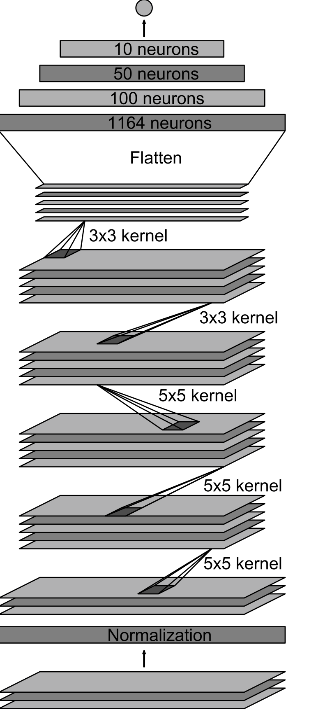
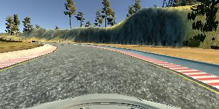
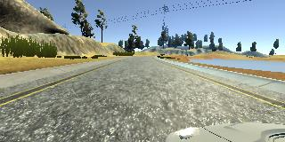
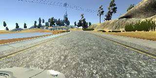
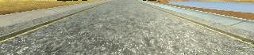

#**Behavioral Cloning** 

##Writeup Template

###You can use this file as a template for your writeup if you want to submit it as a markdown file, but feel free to use some other method and submit a pdf if you prefer.

---

**Behavioral Cloning Project**

The goals / steps of this project are the following:
* Use the simulator to collect data of good driving behavior
* Build, a convolution neural network in Keras that predicts steering angles from images
* Train and validate the model with a training and validation set
* Test that the model successfully drives around track one without leaving the road
* Summarize the results with a written report

---
###Files Submitted & Code Quality

####1. Submission includes all required files and can be used to run the simulator in autonomous mode

My project includes the following files:
* model.py containing the script to create and train the model
* drive.py for driving the car in autonomous mode
* model.h5 containing a trained convolution neural network 
* writeup_report.md or writeup_report.pdf summarizing the results
* video.mp4 result of autonomous driving

####2. Submission includes functional code
Using the Udacity provided simulator and my drive.py file, the car can be driven autonomously around the track by executing 
```sh
python drive.py model.h5
```

####3. Submission code is usable and readable

The model.py file contains the code for training and saving the convolution neural network. The file shows the pipeline I used for training and validating the model, and it contains comments to explain how the code works.

###Model Architecture and Training Strategy

####1. An appropriate model architecture has been employed

The model used from [Nvidia paper](https://devblogs.nvidia.com/parallelforall/wp-content/uploads/2016/08/cnn-architecture.png).

####2. Attempts to reduce overfitting in the model

Model doesn't have dropout layers, because model not overfitted during learning.

####3. Model parameter tuning

The model used an adam optimizer, so the learning rate was not tuned manually (model.py line 105).

####4. Appropriate training data

Training data was chosen to keep the vehicle driving on the road. On the bridge I also recover car position from off road to center.

For details about how I created the training data, see the next section. 

###Model Architecture and Training Strategy

####1. Solution Design Approach

I read paper of End-to-End Deep Learning for Self-Driving Cars and choose their model, beacause that model solve simillary task. After this I tune hyperparams and at the end I set params:

| Hyperparam    | Value   | 
|---------------|:-------:|
| Batch size 	| 32 	  |
| Epochs        | 8		  |


The final step was to run the simulator to see how well the car was driving around track one. There were a few spots where the vehicle fell off the track. To improve the driving behavior in these cases, I record situtations when car turn to the center of the road.

At the end of the process, the vehicle is able to drive autonomously around the track without leaving the road.

####2. Final Model Architecture

The final model architecture (model.py lines 87-100) consisted of a convolution neural network with the following layers and layer sizes:

```
____________________________________________________________________________________________________
Layer (type)                     Output Shape          Param #     Connected to
====================================================================================================
lambda_1 (Lambda)                (None, 160, 320, 3)   0           lambda_input_1[0][0]
____________________________________________________________________________________________________
cropping2d_1 (Cropping2D)        (None, 70, 318, 3)    0           lambda_1[0][0]
____________________________________________________________________________________________________
convolution2d_1 (Convolution2D)  (None, 33, 157, 24)   1824        cropping2d_1[0][0]
____________________________________________________________________________________________________
convolution2d_2 (Convolution2D)  (None, 15, 77, 36)    21636       convolution2d_1[0][0]
____________________________________________________________________________________________________
convolution2d_3 (Convolution2D)  (None, 13, 75, 48)    15600       convolution2d_2[0][0]
____________________________________________________________________________________________________
convolution2d_4 (Convolution2D)  (None, 11, 73, 64)    27712       convolution2d_3[0][0]
____________________________________________________________________________________________________
flatten_1 (Flatten)              (None, 51392)         0           convolution2d_4[0][0]
____________________________________________________________________________________________________
dense_1 (Dense)                  (None, 100)           5139300     flatten_1[0][0]
____________________________________________________________________________________________________
dense_2 (Dense)                  (None, 50)            5050        dense_1[0][0]
____________________________________________________________________________________________________
dense_3 (Dense)                  (None, 10)            510         dense_2[0][0]
____________________________________________________________________________________________________
dense_4 (Dense)                  (None, 1)             11          dense_3[0][0]
====================================================================================================
Total params: 5,211,643
```

Here is a visualization of the architecture.



####3. Creation of the Training Set & Training Process

To capture good driving behavior, I first recorded two laps on track one using center lane driving. Here is an example image of center lane driving:



I then recorded the vehicle recovering from the left side and right sides of the road back to center so that the vehicle would learn to recover fromm off the road to the center.

Then I repeated this process on track two in order to get more data points.

To augment the data sat, I also flipped images and angles thinking that this would get more data and generalize model. For example, here is an image that has then been flipped:

*Original*



*Flipped*

!

In the pipeline I also crop images. That decrease unuseful information for neural network:

*Original*


*Cropped*



Also _cv2_ read images with channels in order BGR, and I decide convert images to RGB and I decreased error from ~8-10% to ~2-3%! It's was surprise.

After the collection process, I had 12465 of data points. I then preprocessed this data by 37395.

I finally randomly shuffled the data set and put 20% of the data into a validation set. 

I used this training data for training the model. The validation set helped determine if the model was over or under fitting. The ideal number of epochs was 8 as evidenced by validation loss 0.0214. I used an adam optimizer so that manually training the learning rate wasn't necessary.
